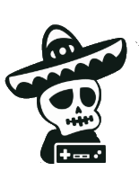

# MexioxMods

Repositorio de todos los mods de Mexiox, aca podras obtener el codigo, modelos 3D, texturas y demas de todos mis mods, todos son de codigo abierto asi que todos podran contribuir y basarse de mis mods para crear los mios sin costo alguno, este repo siempre sera de codigo abierto y los unicos mods creados por Mexiox seran los que fueron creados a comision.

# Mexiox's coleccion de mods de Project Zomboid 

Repositorio oficial de mods creados por Mexiox para Project Zomboid. Todos los mods son de código abierto y están disponibles para su uso, modificación y aprendizaje.

## 📦 Mods Disponibles

### Mexiox Mods Oficiales

- **[Mexiox's - La Chancla](https://steamcommunity.com/sharedfiles/filedetails/?id=2883035657)**
  [Mexiox's - La Chancla Poster](posterimagexd.png)
- **[Mexiox's - Light Sabers](https://steamcommunity.com/sharedfiles/filedetails/?id=2927454765)**
  [Mexiox's - Light Sabers](posterimagexd.png)
- **[Mexiox's - Mexican Firearm Weapons](https://steamcommunity.com/sharedfiles/filedetails/?id=2882852956)**
  [Mexiox's - Mexican Firearm Weapons](posterimagexd.png)

## 🚀 Cómo Usar

1. **Para jugadores:**

   - Suscríbete a los mods via [Mexiox Mods](https://steamcommunity.com/profiles/76561199036949265/myworkshopfiles/?appid=108600)
   - Actívalos en el menú de mods del juego

2. **Para desarrolladores:**
   ```bash
   git clone https://github.com/tu-usuario/Mexiox-Project-Zomboid-Mods.git
   Explora los directorios de cada mod
   ```

## 🛠 Recursos de Modding

[Canal de youtube de Mexiox](https://www.youtube.com/@mexioxstudios)

[Servidor de discord de Mexiox](https://discord.gg/xykfphXyN4)

## 🤝 Contribuir

¡Se aceptan contribuciones! Si quieres:

Reportar un bug → Abre un Issue

Sugerir mejoras → Abre una Discussion

Agregar funcionalidades → Haz un Fork y Pull Request

## Despues actualizo el readme para dar mas contexto, por ahora lo acabo de publicar JAJAJA
